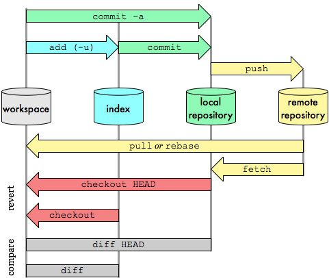
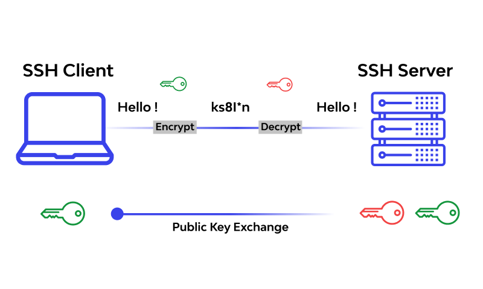

# Git
<p align="center">
  
</p>

Git je distribuirani sistem za kontrolu verzija. On prati promene u bilo kom skupu datoteka, i obično se koristi za koordinaciju rada između programera koji zajedno razvijaju izvorni kod nekog softvera. Njegovi ciljevi uključuju brzinu, integritet podataka i podršku za distribuirane, nelinearne tokove posla (hiljade paralelnih grana koje rade na različitim sistemima).
# Git konfiguracija
Komanda `git config` je pogodna funkcija koja se koristi za postavljanje vrednosti Git konfiguracije na globalnom ili lokalnom nivou projekta. Ovi nivoi konfiguracije odgovaraju `.gitconfig` tekstualnim datotekama. Izvršavanje `git config`-a će izmeniti tekstualnu datoteku konfiguracije.
```
git config --global user.email "your_email@example.com
```
# Osnovne git komande
* `git init` - Kreira prazno git skladište ili ponovo inicijalizuje već postojeće
* `git clone` - Klonira skladište u novi direktorijum
* `git add` - Dodaje fajl u _staging area_
* `git status` - Prikazuje sve fajlove koji treba da budu priloženi (engl. _commit_)
* `git diff` - Prikazuje sve razlike u fajlovima koji nisu još priloženi i onih koji su sačuvani
* `git commit` - Čuva promene u skladištu
* `git reset` - Vraća skladište u neko stanje iz prošlosti
* `git log` - Prikazuje istoriju svih promena trenutne grane
* `git revert` - Vraća neke promene iz prošlosti
```
git init C:/Users/Korisnik/Documents
git clone https://github.com/primer.git
git add projekat
git status
git diff
git commit -m "prvi priloženi fajl"
git reset zadatak.cs
git log
git revert projekat~1
```
# Grananje i stapanje
<sub> engl. _branching and merging_ </sub>
<br />
<br />
Karakteristika Git-a koja ga zaista izdvaja od skoro svakog drugog sistema za kontrolu verzija je njegov model grananja. Git dozvoljava i podstiče da imate više lokalnih grana koje mogu biti potpuno nezavisne jedna od druge. Kreiranje, spajanje i brisanje tih razvojnih linija traje nekoliko sekundi.
* `git branch` - Prikazuje sve postojeće grane, Kreira ili briše grane
* `git merge` - Spaja istoriju navedene grane sa istorijom trenutne grane
* `git pull` - Uzima i spaja promene sa trenutnog skladišta sa navedenim granama
* `git push` - Obnavlja promene na glavnom skladištu koristeći promene sa trenutnog skladišta
```
git branch my2.6.14 v2.6.14   (1)
git merge projekat_1 projekat_2
git pull origin
git push origin master
```
<p align="center">
  
</p>

# SSH
Sigurnosni šel protokol (engl. _Secure Shell Protocol - SSH_) je kriptografski mrežni protokol za bezbedno upravljanje mrežnim uslugama preko nezaštićene mreže. Njegove najistaknutije aplikacije su prijavljivanje sa daljine i izvršavanje sa komandne linije.
<p align="center">
  
</p>
